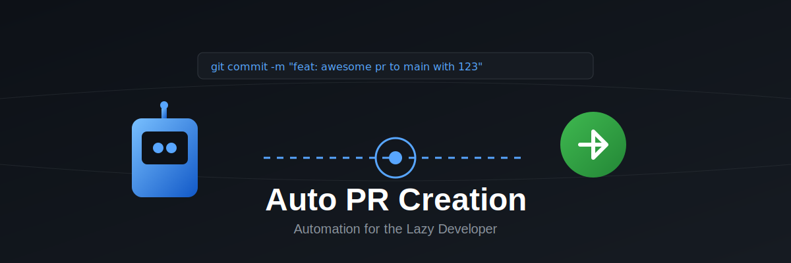

# 🤖 Auto PR Creation GitHub Action



Automate your Pull Request creation process with this GitHub Action! Simply include specific keywords in your commit message, and let the action handle the rest.

[](https://opensource.org/licenses/MIT)

> Read the full story behind this automation in my blog post: [The Lazy Developer's Guide to Automation: How I Made GitHub Work for Me](your-blog-link-here)

## 🌟 Features

- Automatic PR creation based on commit messages
- Intelligent ticket ID extraction and linking
- Default branch fallback mechanism
- Standardized PR template
- Protected branches configuration
- Zero manual PR creation needed

## 🚀 Quick Start

1. Add the action to your repository: at .github/workflow/auto-pr.yml


2. Use the special commit format:
```bash
git commit -m "feat: awesome feature pr to main with 12345"
```

## 📝 Commit Message Format

```bash
<type>: <description> pr to <target_branch> with <ticket_id>
```

Components:
- `type`: The type of change (feat, fix, docs, etc.)
- `description`: Brief description of the changes
- `target_branch`: (Optional) Destination branch (defaults to 'developer')
- `ticket_id`: Task/Issue ID number

## 💡 Examples

Valid commit messages:
```bash
# With specific target branch
git commit -m "feat: add login page pr to main with 10120"
git commit -m "fix: resolve navbar issue pr to developer with 12345"

# Without target branch (defaults to developer)
git commit -m "docs: update  readme pr with 13579"
```

## 🔒 Protected Branches

Default protected branches:
So that pushes to this branch will be discarded
- main
- master
- developer
- uat

## 🚀 Coming Soon

- Groq API Integration for:
  - Intelligent change analysis
  - AI-powered PR descriptions
  - Automated code review suggestions
  - Impact assessment
  - And more!

Follow this repository for updates!

## 🤔 Troubleshooting

Common issues and solutions:

1. **PR Not Created**
   - Check commit message format
   - Verify branch permissions
   - verify your github action has permission to create/update/approve PR.
   - Check GitHub Actions logs

2. **Wrong Target Branch**
   - Verify commit message syntax
   - Check for typos in branch name
   - Confirm branch exists

3. **Missing Ticket ID**
   - Ensure "with <id>" format
   - Check commit message structure
   - Ticket id is optional

## 🤝 Contributing

Contributions are welcome! Please read our [Contributing Guidelines](CONTRIBUTING.md) before submitting a Pull Request.

## 📄 License

This project is licensed under the MIT License - see the [LICENSE](LICENSE) file for details.

## 🙏 Acknowledgments

Special thanks to all the lazy developers out there who inspire us to automate everything!

## 📚 Further Reading

- [Blog Post: The Lazy Developer's Guide to Automation](your-blog-link-here)
- [LinkedIn Article](your-linkedin-post-link-here)
- [GitHub Actions Documentation](https://docs.github.com/en/actions)

---
Built with ❤️ and laziness by [Your Name]
